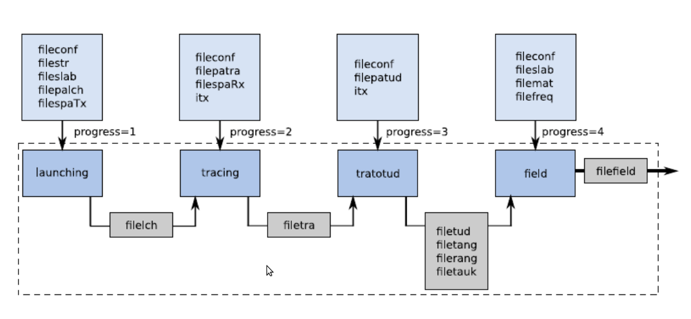

UserManual
==========

.. toctree::
      :maxdepth: 4  

PyLayers is an interactive platform, used for deterministic channel simulation,
using python and C as programming languages. This tool allows the evaluation of
the propagation channel conditions, in indoor environment, between radio nodes for
different antenna directions and waveforms.

It consists in several interacting python modules as well as a set of various high level 
commands coded in C which exchange information through files. 

The main class which is used for defining a Simulation is called `Simul`
which defines the different parameters files relative to a given multilink simulation. 

The simulation workflow goes through several steps; each one is managed by an
independent bloc which corresponds to a standalone command. Those commands are
originaly written in C. 

        + `launching`
        + `tracing`
        + `tratotud`
        + `evalfield`

It is foressen to gradually convert all those 
different block in Python. During this 
transition period where co-exists both python and C tools, we have to deals with
various data formats which feed either the old version of the code or the most recent 
one written and Python and which uses parsing of `ini` files. 

The technical choice which has been made is to use `ini` files which are simple
ascii file which can easily be parsed into Python dictionnary and which are human
readable. One of the interest of the `ini` file is their flexibility because
the order the data apppears in each section is not relevant. 

Overview of the simulation Workflow
------------------------------------

The following figure presents a summary of the different pylayers blocs:

.. image:: _static/workflow1.png
    :scale: 50%

The parameter “progress” indicates the evolution of channel simulation. 
The figure mention others files which are relative to the environment, in fact,
pylayers is a simulation channel tool for indoor environment, for that reason we
need to describe the environment using the object Layout which is
constructed using different files: 

        + `filestr`: geometric details of the propagation environment such as the
          number of points and their coordinates (expressed in meter), the
          number of segment represents the walls, their starts, ends,
          lengths... and the number of  co-segments (windows, floors...)
        + `fileslab`: represents the different dielectric layers, their number
          and thickness  
        + `filemat`: represents the characteristics of the materials defined in
        + `fileslab`: relative permittivity, permeability, conductivity ,

The configuration file fileconf contains the list of parameter files relative
to the simulation. 

Others objects are used in pylayers:

`RadioNode`:  This means a transmitter or a receiver. It manages the spatial and
temporal behavior of a radio node.  GrRay3D: corresponds to the 3D rays between
the receiver and the transmitter.

Prior to any calculation or simulation it is required to define various input files i.e 

        + Layout file    handle in `Layout.py` module 
        + Mat file       handle in `Slab.py` module
        + Slab file      handle in `Slab.py` module 
        + separate space files for tx and rx   

Description of the different blocks 
-----------------------------------

Ray Launching bloc
~~~~~~~~~~~~~~~~~~

+ Bloc Description
       + Function:  in this part of the simulation, knowing the Tx position,
         the aim is to ibuild a tree which facilitates the futher calculation
         of rays.  The launching phase generates different rays the Tx using a
         precalculated visibility matrix. Note that this approach is currently 
        being completely reinterpreted by using dedicated graph data structure. 
        + Operating Base : geometric optic
        + Layer: physical layer  
+ Interfacing
       + Programming language : C
       + Operating system:  works on Linux and not tested on windows
       + Input/output list: 
        The parameter of this module are given by the input files:
                 + `filepalch`
                 + `filestr`
                 + `filetx.spa`  
  Once the launching is achieved the output file is
        + `filelch` this files contains a tree emanating from the transmitter
          and goes through the entire layout until ithe layout. Breadth and
          depth exploration of the graph is balanced by using various
          propagation heuristics. 
        + Input/output format:  both Input and Output are ASCII files  

Ray Tracing bloc
-----------------

+ Bloc Description
        + Function: at this step of simulation, the coordinates of the
          receivers are used to calculate the rays between the receivers and
          transmitter + Operating Base : geometric optic 
        + Layer: Physical layer 
+ Interfacing 
        + Programming language: Python and C 
        + Operating system: works on Linux  and not tested on windows
        + Input/output list:  
        The parameters of the tracing module are given by the input file : 
        filepatra, the filelch is used as input to determine the rays to the receivers. As the launching module an output file filetra is generated.
        + Input/output format : both Input and Output are ASCII files  

3D rays computing using TUD 
----------------------------   

+ Bloc Description
        + Function: after ray launching and tracing, all we have is geometric models for rays between the Tx and Rx, on which we need to apply electromagnetic models. In order to have the 3D-TUD rays.
        + Operating Base : uniform theory of diffraction 
        + Layer: physical layer 

+ Interfacing 
        + Programming language: Python and C 
        + Operating system: works on Linux  and not tested on windows
        + Input/output list:  the input files are: filepatud for TUD parameter
          and the tracing file filetra. At the end 4 files are generated:
          filetud: containing 3d-TUD rays, filetauk: relative to propagation
          delay for each ray and fileang and filerang: for departure and
          arrival angles for each ray.  
        +  Input/output format: both Input and
          Output are ASCII files  

Electromagnetic field evaluation 
~~~~~~~~~~~~~~~~~~~~~~~~~~~~~~~~   

+ Bloc Description
        + Function: this bloc allow  the evaluation the electromagnetic filed by executing the  field module of Simulation 
        + Operating Base : combination of ray tracing, optical geometrics and TUD methods 
        + Layer: physical layer 

+ Interfacing 
        + Programming language: Python and C
        + Operating system: on Linux  and not testes on windows
        + Input/output list: input file: filefreq for the frequency range and the output file is filefield containing the relation the matrix connecting the transmitted and received field.   
        + Input/output format: both Input and Output  are ASCII files 

        Regarding the execution time it depends on several parameters such as the
        environment (point, segment, nodes, edges...)  or the requirement: minimum
        number of rays...

Simulation File        
----------------

This example load a simulation file and shows the layout with the surimposed
grid of tx and rx points which define the links of interest for the simulation 

.. plot::
    :include-source:        

    from pylayers.simul.simulem import *
    from pylayers.gis.layout import *
    from numpy import *
    import matplotlib.pylab as plt  

    S = Simul('example.ini')
    S.L.showGs()
    plt.show()

Getting started 
---------------

Before starting a simulation it is required to fill a ini file which gathers
the information required for starting a simulation.

Simulation `.ini`  file
~~~~~~~~~~~~~~~~~~~~~~~

Below is presented an example of a simulation file `default.ini`::

    [files]
    mat = matDB.ini
    tx = radiotx.ini
    slab = slabDB.ini
    txant = defant.vsh3
    rx = radiorx.ini
    patra = def.patra
    conf = project.conf
    palch = def.palch
    struc = Lstruc.str
    rxant = defant.vsh3

    [waveform]
    tw = 30
    band = 0.499
    fc = 4.493
    thresh = 3
    fe = 50
    type = generic

    [frequency]
    fghzmin = 2.0
    fghzmax = 11.0
    nf = 181

    [tud]
    purc = 100
    num = -1
    nrmax = 500

    [output]
    1 = default1.ini

    

This file is composed of independant sections which are respectively ::

        [files]
                This section contains the short name of the required input file 
                for high level commands 
        [launching]
                various parameters for the launching phase 
        [tracing]
                various parameters for the tracing phase 
        [waveform]
                parameters defining the applied waveform 
        [frequency]
                electromagnetic frequency range 
        [tud]
                ray filtering parameters
        [output]
                already calculated output files

Output Section 
--------------

The output section is used to keep track of already calculated links. The key 
is an integer which correspond to a radionode index and the corresponding
associated value is a file which is stored in the `output` directory of the
project. 

Below is an example of the content of an output `.ini` file ::

    [rang]
    1 = defstr_slabDB_def_radiotx_1_def_radiorx_1_0_500.rang

    [trace]
    1 = defstr_slabDB_def_radiotx_1_def_radiorx_1.tra

    [launch]
    1 = defstr_slabDB_def_radiotx_1.lch

    [tang]
    1 = defstr_slabDB_def_radiotx_1_def_radiorx_1_0_500.tang

    [tauk]
    1 = defstr_slabDB_def_radiotx_1_def_radiorx_1_0_500.tauk

    [field]
    1 = defstr_slabDB_def_radiotx_1_def_radiorx_1_0_500.field

    [tud]
    1 = defstr_slabDB_def_radiotx_1_def_radiorx_1_0_500.tud

    [cir]
    1 = where2cir-tx001-rx001

Terminology
-----------

        One of the key design idea of the ray tracing tool is to pre-process
        the Layout description exploiting the graph abstract data structure. 

        Terms **nodes** and **edges** are used when refering to graph elements of :math:`\mathcal{G}_{x}(\mathcal{V},\mathcal{E})`. 
        Terms **points** and **segments** are used when refering to geometrical object. 
        
        A `str2` file is a list of points with their coordinates and a list of segments associating 
        those points by pairs. 

        The description of the layout exploits a **non overlaping  rule**,
        (which is checked regularly when creating a new layout for not braking the consistency of the associated graph description).

        **Non overlaping rule**:
                A segment must never has, as a member, a point of the layout which is not one of its extremity.

        This rule aims maintaining intrinsically a consistent spatial relationship between points and segments. 

        see :ref:`Uguen2012`_

Using the Bsignal Module 
------------------------

.. toctree::
    :maxdepth: 2

    bsignal.rst 
