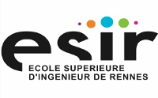
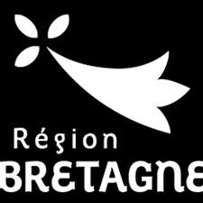
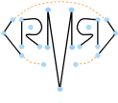

PyLayers : Python mobile Localization Electromagnetics Radio Simulator 
=======================================================================

Pylayers is a mobile radio propagation simulator. Its purpose is to help
designing localization and tracking algorithms for advanced communications
systems. It might be hopefully useful for illustrating various topics
on wireless communications and localization for higher education in
wireless systems. 

Example 
=======

.. ipython::
    

      In [1]: from pylayers.antprop.coverage import *

      In [2]: C = Coverage()

      In [2]: C.tx = np.array((30,12))

      In [3]: C.cover()

      @savefig coverexampleo.png width=5in
      In [4]: C.showPower(polarization='o')
      
      @savefig coverexamplep.png width=5in
      In [4]: C.showPower(polarization='p')
..    In [1]: import pylayers.simul.simulem as sem

..    In [1]: S = sem.Simul()

..    @savefig example.png width=4in
..    In [1]: S.show()

Context
=======

PyLayers is being developed for research into radio localization exploiting impulse radio
signals as being defined in the IEEE 802.15.4a and 802.15.6 standards.
Pylayers could also evolved to help with studies related to channel characterization,
Wireless Sensor Network, MANET, radio cooperation and relaying techniques, 
physical layer security, WBAN applications, advanced home automation, aware environments ...

Pylayers is modular and designed to be easily extended, 
allowing it to evolve over the time as a tool for research and development in a wide range 
of communications and localization topics.

Features
========

Indoor Layout 
-------------

* Layout edition
* Extensive graph description of layout  

Antenna & Propagation Modeling
------------------------------

* Full space vector antenna patterns using a sparse spherical harmonics representation  
* Multi layers transmission coefficients 
* Motley Keenan model 
* Ray signature determination and analysis 
* Embedded C coded UWB ray tracing engine

Signal Processing
-----------------

* Impulse Radio Ultra Wideband Waveforms 
* custom class for UWB signal processing 
* Time of Arrival ranging estimation   

Agent Mobility Handling
-----------------------

* Mobile user mobility based on `SimPy <http://simpy.sourceforge.net>`_

Localization Algorithms
-----------------------

* Set Membership positioning algorithm toolbox
* Heterogeneous radion positioning toolbox 

Documentation
=============

Pylayers is still in an early stage of its development. The code as well as the
documentation are in a beta version. The user manual section is embryonary and 
will be regularly populated with new examples of utilization. Pylayers is
better used in association with `ipython <http://ipython.org>`_

.. toctree::
    :maxdepth: 1 

    manual/index.rst 

.. toctree::
    :maxdepth: 1 

    modules/index.rst
    

Third party packages 
====================

Pylayers is written in Python and tributes highly the following Python packages:

* numpy ( for algebra in multi dimensions )  
* scipy ( for scientific libraries )
* SimPy ( for discrete events simulation ) 
* matplotlib ( for the graphical outputs ) 
* networkx ( for graph description and algorithms ) 
* shapely ( for planar geometry )   
* spherepack (for spherical harmonics library)  
* ipython ( to rule them all ... ) 

Pylayers relies also on the interactive 3D viewing program `geomview <http://www.geomview.org>`_ tool for fast and simple interaction with 3D entities. 

Developpers
===========

Pylayers is driven by professor Bernard Uguen at `University of Rennes 1
<http://www.univ-rennes1.fr/english>`_, `IETR laboratory <http://www.ietr.fr/>`_ and 
`ESIR school of engineering <http://esir.univ-rennes1.fr/>`_

Pylayers is currently developed at IETR  by Bernard Uguen, Nicolas Amiot, Mohamed
Laaraiedh and Meriem Mhedbhi, with the technical support of all the members from the
Research Team of the Propagation and Localization team of the `IETR
<http://www.ietr.fr>`_ lab.    

Among early pylayers contributors : Friedman Tchoffo Talom, Louis Marie Aubert, Roxana Burghelea, Yu Lei, Taguhi
Chaluyman, Stéphane Avrillon and Eric Plouhinec (Saint-Cyr Research center).

Download and Installation
=========================

The current version is tagged 0.1. Download the
last release in your preferred format on github.

.. code-block:: bash
    
    $ git clone https://github.com/pylayers/pylayers.git

We warmly encourage all new user to contribute new suggestions, algorithms, models and other improvements back to the project

**Just fork it !** on your github account and get in touch on the mailing list
if you get some interest or seek for applications.

Mailing List
============

There is a "http://groups.google.com/group/pylayers-users" mailing list for
users of Pylayers on which you can get help with using or extending the
software. New releases will also be announced on the mailing list. 

Acknowledgements 
================

This work has been supported by the Bretagne Region council (Project LOCUS), by the french ANR
project AUBADE and CORMORAN and by the European projects `FP7 UCELLS <http://www.ist-ucells.org/>`_, 
FP7 WHERE1, `FP7 WHERE2 <http://www.ict-where.eu/>`_.

License
=======

Copyright ©, 2013 University of Rennes 1

Pylayers is free software: you can redistribute it and/or modify it under the
terms of the GNU General Public License as published by the Free Software
Foundation, either version 3 of the License, or (at your option) any later
version.

Pylayers is distributed in the hope that it will be useful, but WITHOUT ANY WARRANTY; without even the implied warranty of MERCHANTABILITY or FITNESS FOR A PARTICULAR PURPOSE.  

