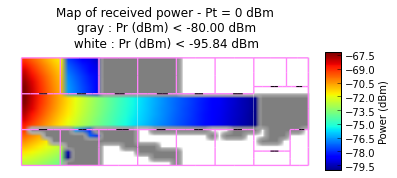
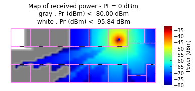
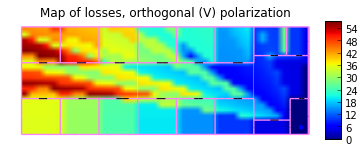

Initialization
==============

Import the ``coverage`` module

In[1]:

.. code:: python

    from pylayers.antprop.coverage import *
    import time

Instantiate a coverage object. By defaut, ``TA-Office.str`` layout
strucure is loaded.

This information can be modified in the **coverage.ini** file in the
project directory::

    [pl_model]
        sigrss = 3.0 
        f = 3.0 
        rssnp = 2.64 
        d0 = 1.0

    [grid] 
        xstep= 40 
        ystep= 20

    [layout] 
        filename = TA-Office.str ;
        filename = Lstruc.str

    [tx] 
        x = -10 
        y = 10 
        ;transmitted power (dBm) 
        ptdbm = 0
        ; frame length in
        bytes framelengthbytes = 50000

    [rx] 
        sensitivity = -80 
        bandwidthmhz = 3 
        temperaturek = 300 
        noisefactordb = 13

    [show]
        show = True

.. code:: python

    C = Coverage()
    C.L.filename

.. parsed-literal::

    'TA-Office.str'

Calulating Received Power Coverage
==================================

Coverage required the Layout graphs have been produced.

-  If the graphs for the given layout have already been built, they are
   loaded from the project directory.
-  Otherwise, they are built **(it may take few minutes depending on the
   layout complexity)** and stored into the project directory for the
   next execution.

.. code:: python

    try :
        C.L.dumpr()
    except:
        C.L.build()

Then, the coverage calculation can be launched in calling the ``cover``
method

.. code:: python

    C.cover()

The coverage results can be displayed by invoquing various functions.

-  showLoss : display the path loss
-  showPower : display the received power

.. code:: python

    C.showPower()

The transmitter coordinates are :

.. code:: python

    C.tx

.. parsed-literal::

    array([-10,  10])

This can be modified on the flight, and the coverage is updated

.. code:: python

    C.tx = np.array((30,12))
    
    %timeit
    C.cover()
    
    C.showLoss(polarization='o')
    C.showPower(polarization='o')
    C.showLoss(polarization='p')
    C.showPower(polarization='p')

.. image:: Coverage_files/Coverage_fig_01.png

.. image:: Coverage_files/Coverage_fig_02.png

.. image:: Coverage_files/Coverage_fig_03.png

.. code:: python

    C.tx = np.array((39,1))
    start = time.time()
    C.cover()
    finish = time.time()
    print 'All coverage calculated in %1.2f seconds' % (finish-start)
    C.showLoss(polarization='o')
    C.showPower(polarization='o')

.. parsed-literal::

    All coverage calculated in 6.88 seconds

.. image:: Coverage_files/Coverage_fig_06.png

The excess delay due to crossing the wall can also be evaluted.

.. code:: python

    C.tx = np.array((20,4))
    C.cover()
    C.showEd()

.. image:: Coverage_files/Coverage_fig_07.png
