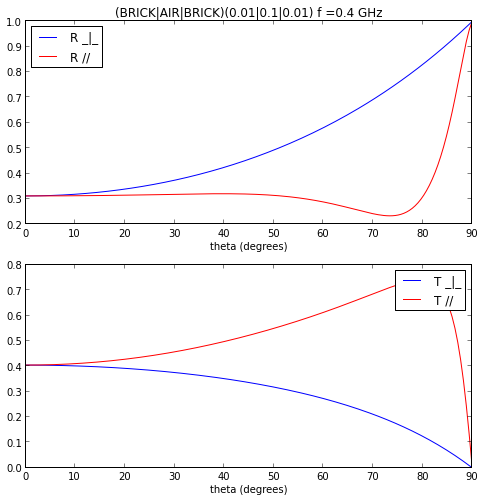
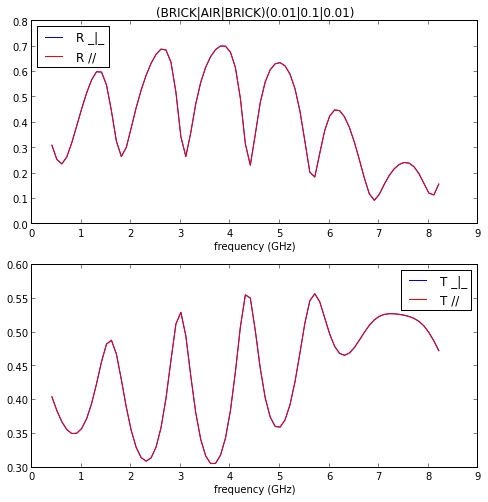
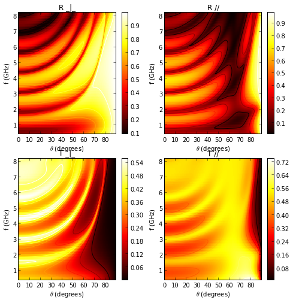
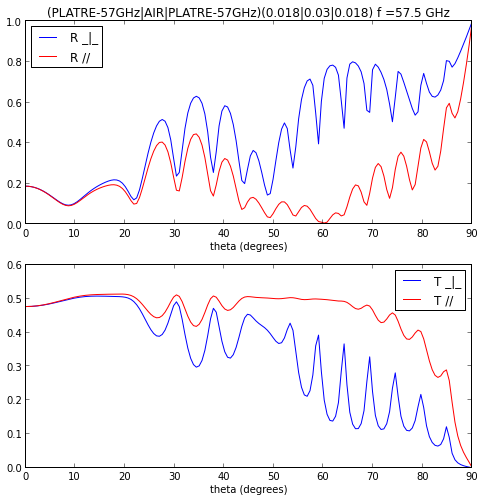

Slab and Materials
==================

Handling of slabs and material is done in the `slab.py` module in section
`antprop`. 

.. code:: python

    #import mplrc.ieee.transaction
    from pylayers.antprop.slab import *
    from pylayers.util.project import *
    import numpy as np

The module `project.py` handle the directory name of the `Pylayers`
project structure. 

.. note::
    A slab is a sandwich (list) of one or several material with an associated
    thickness

The material database is store in a simple ASCII .ini file as well as the slab
database. 

To instantiate a Slab object it is required to provide both the information of
the material database and the slab database. Those 2 database need to be
consistent. 

.. todo::
    check database consistency 

The default name for those 2 databases are `matDB.ini` and  `slabDB.ini`.
There exist adder and getter for populating this database and saving it in a
new file. This make sense because each layout may have it's own associated
slab database.

.. code:: python

    sl=SlabDB('matDB.ini','slabDB.ini')

The correspondence between an integer and the name of the available
slabs is available in `sl.di` dictionary. This association is required
for compatibility with EM solver PulsRay which needs an associated
numerical value for each slab. 

.. code:: python

    sl.di

.. parsed-literal::

    {-1: 'METALIC',
     0: 'ABSORBENT',
     1: 'AIR',
     2: 'WALL',
     3: 'PARTITION',
     4: 'WINDOW',
     5: 'DOOR',
     6: 'CEIL',
     7: 'FLOOR',
     8: 'WINDOW_GLASS',
     9: 'WOOD',
     10: '3D_WINDOW_GLASS',
     11: 'WALLS',
     12: 'PILLAR',
     13: 'METAL',
     14: 'CONCRETE_15CM3D',
     15: 'CONCRETE_20CM3D',
     16: 'CONCRETE_6CM3D',
     17: 'CONCRETE_7CM3D',
     18: 'PLASTERBOARD_10CM',
     19: 'PLASTERBOARD_14CM',
     20: 'PLASTERBOARD_7CM'}

The material database becomes a member of the slab database, and as
previously said there is also an ad hoc dictionary available in order 
to keep the association between a material id and the material name.

.. code:: python

    mat = sl.mat
    mat.di 

.. parsed-literal::

    {-1: 'METAL',
     0: 'ABSORBENT',
     1: 'AIR',
     2: 'BRICK',
     3: 'PLASTER',
     4: 'GLASS',
     5: 'CONCRETE',
     6: 'REINFORCED_CONCRETE',
     7: 'WOOD',
     8: 'STONE',
     9: 'SEA_WATER',
     10: 'PLATRE-57GHz'}

It is possible to easily define individual materials

.. code:: python

    lmat    = ['BRICK','AIR','BRICK']
    lthick = [0.01,0.1,0.01]
    sl.add('placo',lmat,lthick)

Once a slab  is defined, it is possible to evaluate it over a range of angles
and a range of frequencies. 

.. code:: python

    theta  = np.arange(0,np.pi/2,0.01,dtype=np.float64)
    fGHz   = [2.4]
    sl['placo'].ev(fGHz,theta)

In[37]:

.. code:: python

    figsize(8,8)
    sl['placo'].plotwrta()

.. code:: python

    fGHz   = np.arange(0.4,8.3,0.1)
    sl['placo'].plotwrtf()

In[39]:

.. code:: python

    sl['placo'].pcolor()

This example is in describe in page 90 of the thesis "Simulation du
canal de propagation indoor " par Cyril Humbert

In[42]:

.. code:: python

    lmat    = ['PLATRE-57GHz','AIR','PLATRE-57GHz']
    lthick = [0.018,0.03,0.018]
    sl.add('Humbert',lmat,lthick)
    fGHz = np.array([57.5])

This example can be found in the PhD Thesis document of Cyril Humbert
humb03.pdf page 96

In[44]:

.. code:: python

    sl['Humbert'].ev(fGHz,theta)
    sl['Humbert'].plotwrta()

